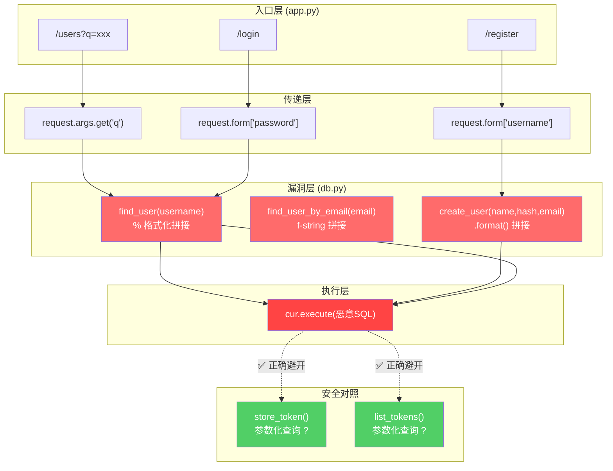

# SQL注入漏洞分析流程图

```mermaid
flowchart TB
    subgraph 入口["入口层 (app.py)"]
        A1["/users?q=xxx"]
        A2["/register"]
        A3["/login"]
    end

    subgraph 传播["传递层"]
        B1["request.args.get('q')"]
        B2["request.form['username']"]
        B3["request.form['password']"]
    end

    subgraph 漏洞["漏洞层 (db.py)"]
        C1["find_user(username)<br/>% 格式化拼接"]
        C2["find_user_by_email(email)<br/>f-string 拼接"]
        C3["create_user(name,hash,email)<br/>.format() 拼接"]
    end

    subgraph 执行["执行层"]
        D1["cur.execute(恶意SQL)"]
    end

    subgraph 安全["安全对照"]
        E1["store_token()<br/>参数化查询 ?"]
        E2["list_tokens()<br/>参数化查询 ?"]
    end

    A1 --> B1 --> C1 --> D1
    A2 --> B2 --> C3 --> D1
    A3 --> B3 --> C1 --> D1

    D1 -.->|"✅ 正确避开"| E1
    D1 -.->|"✅ 正确避开"| E2

    style C1 fill:#ff6b6b,color:#fff
    style C2 fill:#ff6b6b,color:#fff
    style C3 fill:#ff6b6b,color:#fff
    style D1 fill:#ff4444,color:#fff
    style E1 fill:#51cf66,color:#fff
    style E2 fill:#51cf66,color:#fff
```